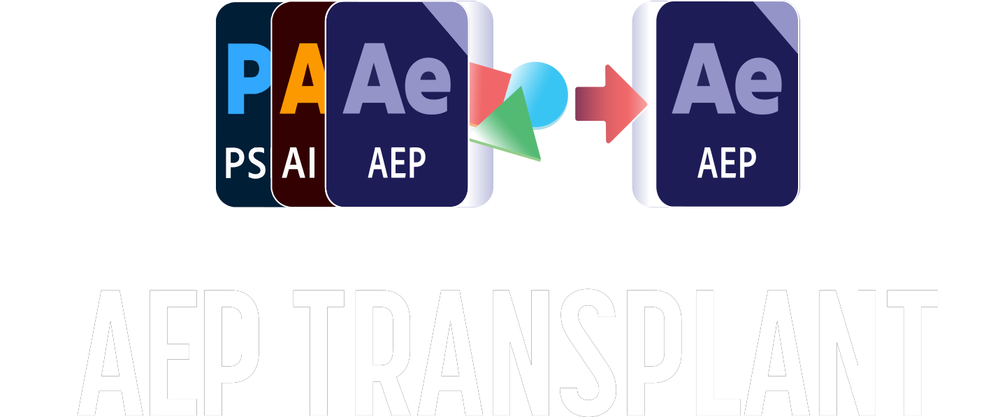

  Pull comps & assets from any <strong>AEP, PSD or AI</strong> directly into your current project.

  Browse any project file without leaving After Effects, cherry-pick exactly what you need, and merge it in cleanly. No more Reduce Project. No more duplicated assets.

[Get it on AeScripts.com](https://www.aescripts.com) [User Guide →](aeptransplant)

<!-- background color -->

