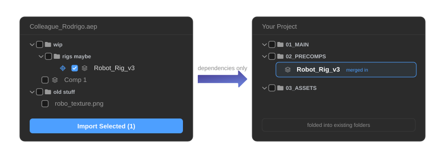

# AEP Transplant

Every motion designer knows this situation: you need to revert a single comp to a previous version. And it looks like this:

1. Close your current project
2. Open the old one
3. Manually reduce it down
4. Save a copy
5. Reopen your current project
6. Import
7. Replace the comp
8. Clean up the duplicate assets and broken folder structure you just created

**For. One. Comp.**

The same problem comes up constantly: borrowing an asset from a colleague's project, pulling a rig you built six months ago, updating a comp another animator owns without disrupting your own project. These should be quick operations.

**AEP Transplant makes them simple.** Open any `.aep`, `.psd`, or `.ai` file in the panel, [browse its full contents, pick exactly what you need](features.md#browse-import), and import only that, along with its real dependencies and nothing else.

When duplicate assets exist, [AEP Transplant asks you what to do](features.md#smart-merge): replace, use the current version, or keep both. Your project stays tidy either way.

It also opens up workflows that weren't practical before: a shared master project where all animators source the latest versions of assets and comps, always up to date, without ever touching each other's files.

Any questions, comments, or feedback?  
Feel free to email me at [help@gareso.com](mailto:help@gareso.com)

---

  <strong style="color: #1e1e1e;">Made by&nbsp;</strong>
  

