# Features

---

<h2 id="browse-import">Browse & Import</h2>

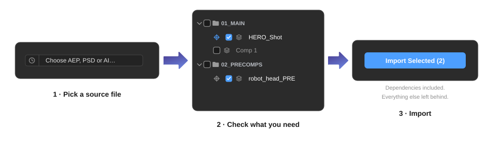

The core workflow:

1. Click **→ Choose AEP, PSD or AI…** and pick a source file.
2. The panel reads the file and displays its full folder/asset structure, no need to open it in After Effects.
3. Check the items you want to import.
4. Click **Import Selected**.

AEP Transplant extracts only the checked items and their real dependencies. Everything else in the source project stays behind. Footage that isn't reachable from your selection is never imported.

**Supported file types:**

| Type | What you browse | What gets imported |
| ---- | --------------- | ------------------ |
| `.aep` | Full project tree: comps, folders, all footage | Selected items + their real comp/footage dependencies |
| `.psd` / `.psb` | Layers of the document | Selected layers as individual footage items |
| `.ai` | Layers / artboards of the document | Selected layers as individual footage items |

> The import itself is not undoable via Cmd+Z. To fully remove an import, undo the merge step (Cmd+Z/Ctrl+Z once), which parks everything into a labeled folder at the project root, then manually delete that folder. See [Undo Behavior](features.md#undo) for the full breakdown.

### Missing Source Files

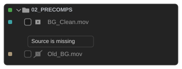

If a footage item's source file can't be found on this machine, its row is dimmed and its icon crossed out, with a tooltip explaining why. Its checkbox is disabled: importing it directly would only bring in missing footage. It can still come in as a real dependency of a comp you do select, since After Effects resolves that on its own at import time.

---

<h2 id="search-filter">Search & Filter</h2>

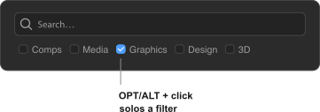

**Search** filters the asset tree by name (case-insensitive substring). Results update live as you type.

**Filter checkboxes** show or hide items by category:

| Filter | Covers |
| ------ | ------ |
| Comps | After Effects compositions |
| Media | Video and audio files |
| Graphics | Image files (PNG, JPG, EXR, TGA, SVG…) |
| Design | Layered design files (PSD, AI, PDF, EPS…) |
| 3D | 3D asset files (C4D, OBJ, FBX, GLTF…) |

**OPT/ALT + click** a filter checkbox to solo it, showing only that category and hiding the rest. OPT/ALT + click again to restore the previous state.

Filter preferences are saved between sessions.

---

<h2 id="target-picker">Target Picker</h2>

When an item is checked, a **crosshair icon** appears next to it:

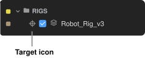

Click it to open the Target Picker, a modal that lets you manually point that imported item at a specific existing item or folder in your current project, overriding the automatic name-based merge matching.

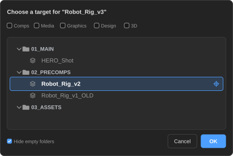

| Target type | What happens at import |
| ----------- | ---------------------- |
| **Comp or footage item** | Replaces the targeted item. Layers and expressions referencing it update automatically. |
| **Folder** | Places the imported item into that folder instead of wherever the merge logic would put it. |

Use the search bar and filter checkboxes inside the picker to quickly find the right target in a large project. OPT/ALT + click any folder arrow to collapse or expand all folders at once.

Once a target is set, the crosshair icon turns **blue**. OPT/ALT + click it to clear the assignment.

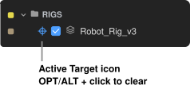

---

<h2 id="smart-merge">Smart Merge</h2>

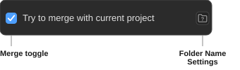

Enable **Try to merge with current project** before importing to fold the incoming content into your existing folder structure.

With merge on, AEP Transplant matches each imported folder against your current project and combines them rather than creating a new top-level import folder. Matching happens in three passes, in order:

1. **Exact name.** An imported folder is combined with a folder of the identical name in your project.
2. **Similar name.** AEP Transplant recognizes common naming variations: ordering prefixes and suffixes are ignored (`a.precomps` matches `02_PRECOMPS`), and common naming dialects count as the same folder (`Images` / `Bitmaps` / `Graphics` / `PNGs`, `Footage` / `Videos` / `Movies`, `Audio` / `Music` / `SFX`, `Precomps` / `Pre Comps` / `Precompositions`, and more).
3. **Content.** If nothing matches by name at all, a folder whose contents already exist somewhere in your project is combined into wherever those live.

How the first two passes rank against each other is configurable in [Folder Merge Settings](features.md#folder-merge-settings): by default an exact name match wins wherever it sits in your project, but you can instead favor folders higher in your structure — see the **Folder merge** option there.

A folder that finds no match of its own doesn't strand what's inside it. AEP Transplant keeps looking one level deeper: subfolders hunt for their own match independently, so a source project that nests everything under one project-named folder still merges cleanly instead of landing as a single unmatched block. Whatever remains after that still gets carried into the closest matched folder, so nothing is left behind unless truly nothing in that branch matches anything in your project.

If a same-named item already exists in your project, you'll be prompted:

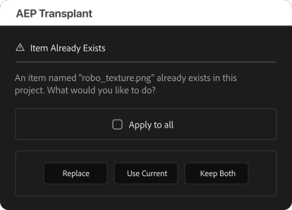

| Option | What it does |
| ------ | ------------ |
| **Replace** | Swaps the existing item with the incoming one. Layers and expressions that reference it automatically point to the new version. |
| **Use Current** | Keeps your existing item and discards the incoming duplicate. |
| **Keep Both** | Imports the incoming item alongside the existing one (name is suffixed). |

Check **Apply to all** before choosing an option to use that same choice for every remaining conflict in this import, instead of being prompted again for each one.

The merge step collapses into a **single Undo** (Cmd+Z/Ctrl+Z once restores everything to a labeled folder at the project root). The import that preceded it is separate and not undoable.

> Merge preference (on/off) is remembered between sessions.

---

<h2 id="folder-merge-settings">Folder Merge Settings</h2>

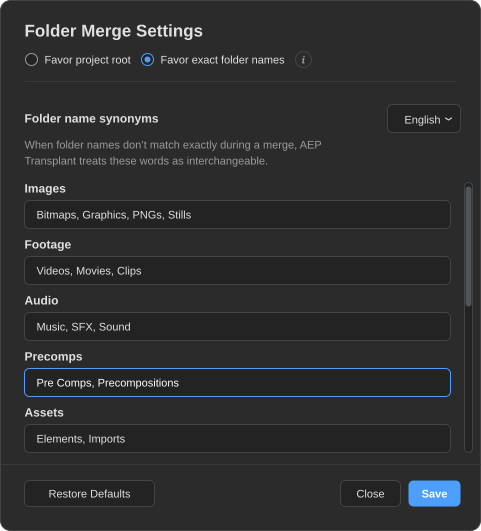

This window controls how folders are matched during a merge: the matching strategy, and the word lists that drive the "similar name" pass above. Open **Folder Merge Settings…** from the panel's context menu (right-click the panel, or its **☰** menu).

| Control | Description |
| ------- | ----------- |
| **Folder merge** | Picks the matching strategy. **Favor exact folder names** (default): an exact name match always wins, wherever it sits; synonyms and similar names are used only when no exact match exists. **Favor project root**: a matching folder higher up in your project (exact name, synonym, or similar name) wins over an exact name buried deeper. |
| **Language preset** | Swaps every list for a language's own common folder names. English, Spanish, French, German, Italian, Portuguese, Japanese, Korean, Chinese, and Russian are built in. |
| **Synonym fields** | One comma-separated list per asset type (Images, Footage, Audio, Precomps, and more). Add or remove words freely. |
| **Restore Defaults** | Resets every list back to the selected language's built-in defaults (the Folder merge choice is left alone). |
| **Save** | Applies your changes immediately, no restart needed. |

> Changes apply to every merge afterward, in any project. There's no need to keep the settings window open.

---

<h2 id="swap-source">Swap Source</h2>

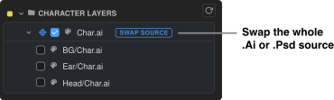

A **SWAP SOURCE** row appears above the individual layer items of any PSD or AI file, marked with a blue badge. This includes PSD/AI files loaded directly *and* PSD/AI files nested inside an `.aep` you loaded, since AEP Transplant surfaces their layers the same way either way.

**Swap Source** lets you replace every layer of a source file across your entire current project in one action, instead of updating each layer one by one. This is perfect for re-skinning a character rig or updating artwork across a complex project.

**How it works:**

1. Check the **SWAP SOURCE** row (and/or its individual layer rows).
2. Click the **crosshair icon** that appears next to the checked row to open the [Target Picker](features.md#target-picker).
3. In the picker, select the existing footage item in your current project that you want to replace.
4. Click **Import Selected**.

AEP Transplant matches the source file's layers to the targeted item's layers by name, replaces each one, and handles any layers that don't find a match by parking them in a "no match" folder.

> OPT/ALT + click the crosshair icon to clear a target assignment.

---

<h2 id="external-assets">External Assets</h2>

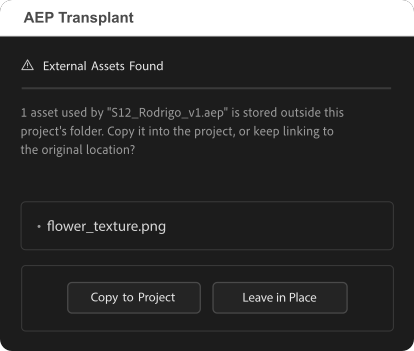

If the items you're importing use footage stored outside your current project's folder (a colleague's drive, a different job folder, anywhere not under your project), AEP Transplant asks what to do before finishing the import:

| Option | What it does |
| ------ | ------------ |
| **Copy to Project** | Copies the external files into your project folder and relinks the imported items to the copies. |
| **Leave in Place** | Leaves the imported items linked to their current location. |

Copies land in a new folder named `<source file> - AEP Transplant`, created next to wherever your project already keeps most of its footage. Image sequences are copied as a whole, every frame included. If you import from the same source file again later, previously copied assets are reused instead of duplicated.

> This check only runs on a saved project, since AEP Transplant needs your project's location to know what counts as "external" in the first place.

---

<h2 id="update-watcher">Update Watcher</h2>

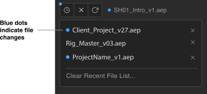

AEP Transplant watches the files you've worked with and tells you when they change:

- A **blue dot on the clock button** means one or more projects in your recent list have been saved since you last loaded them here.
- A **blue dot next to the loaded file name** means the currently open source file has changed on disk since you loaded it.
- Blue dots **inside the [Recent Projects](interface.md#recent-projects) list** appear on individual entries that have updated.

Click **↺ Reload** to re-read the current file from disk and pick up any changes.

This is especially useful on shared projects: if a teammate updates an `.aep` you're sourcing from, the dot lets you know before you import stale content.

> Reload only refreshes what's showing in the tree. It has no effect on what actually gets imported: every import already reads the file's current state from disk, whether or not you've clicked Reload first.

---

<h2 id="undo">Undo Behavior</h2>

AEP Transplant separates the import into two phases, each with different undo behavior:

| Phase | Undoable? | Notes |
| ----- | :-------: | ----- |
| **Import** | No | Brings the reduced project into AE. Cannot be reversed via Cmd+Z. |
| **Merge** | Yes | Every move, replace, and rename collapses into a single Undo step. |

**To fully discard an import:**
1. Undo the merge: Cmd+Z/Ctrl+Z **once**. This parks everything back into a single labeled folder at the project root (named after the source file, suffixed `(not merged)` if anything was left unmatched).
2. Manually delete that folder from the Project panel.

Nothing is ever silently lost; it's one manual deletion instead of a full automatic undo.
