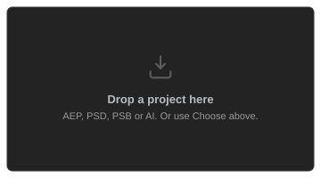
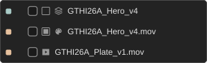
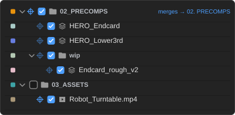
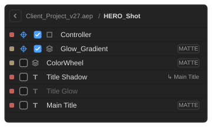
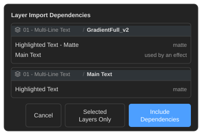
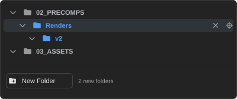
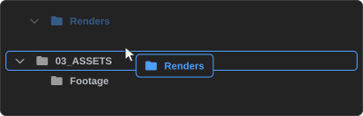
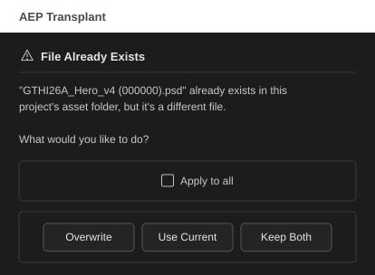

# Features

---

<h2 id="browse-import">Browse & Import</h2>

The core workflow:

1. Click **→ Choose AEP, PSD or AI…** and pick a source file, or drag one straight onto the panel.
2. The panel reads the file and displays its full folder/asset structure, no need to open it in After Effects.
3. Check the items you want to import.
4. Click **Import Selected**.

Once a file is loaded that button becomes an **✕**, which clears it again along with whatever you had checked and any destinations you had set, ready for a different source.

Only the checked items and their real dependencies are extracted. Everything else stays behind.

That includes whatever your selection reaches through an **expression**, which nothing else in the project points at. You are shown what has to come and asked first. See [What comes with a layer](features.md#what-comes-with-a-layer).

**Supported file types:**

| Type | What you browse | What gets imported |
| ---- | --------------- | ------------------ |
| `.aep` | Full project tree: comps, folders, all footage | Selected items + their real comp/footage dependencies |
| `.psd` / `.psb` | Layers of the document | Selected layers as individual footage items |
| `.ai` | Layers / artboards of the document | Selected layers as individual footage items |

> The import itself is not undoable. To remove one, undo the merge (Cmd+Z/Ctrl+Z once), which parks everything into a labeled folder at the project root, then delete that folder. See [Undo Behavior](features.md#undo).

#### Proxies

An item with a proxy carries the same small box After Effects shows in its Project panel: an outline when a proxy is set, filled when it's the one being used. It also takes the proxy's icon, exactly as in your Project panel.

Proxies travel with their items. See [External Assets](features.md#external-assets) for the proxy files themselves.

#### Missing Source Files

If a footage item's source file can't be found, its row is dimmed and its icon crossed out. Its checkbox is disabled, since importing it alone would only bring in missing footage, but it still comes along as a dependency of a comp you do select.

---

<h2 id="folder-import">Folder Import</h2>

Folders tick like anything else. Checking one takes everything inside it, all the way down, which saves hunting through a long list of comps a row at a time.

Selection only travels downwards: picking a few comps out of a folder by hand leaves the folder's own tick exactly where you left it.

#### Sending a whole folder somewhere

A folder carries a **crosshair** like any other row, and what it sets covers the whole branch: every row underneath travels to the same place and shows that destination instead of setting its own. **OPT/ALT + click** it to clear the target and hand those rows back their own.

Where the branch lands depends on the folder's **own name**:

| The folder you picked | What happens |
| --------------------- | ------------ |
| Means the same folder (`a.precomps` aimed at `02_PRECOMPS`) | The contents **merge into** it |
| Means something else (`SH030_Theme` aimed at `Library`) | The folder **nests inside** it, arriving as a folder of its own |

Names are matched as they are everywhere else, so ordering prefixes, suffixes and your own naming dialects all count. See [Folder Merge Settings](features.md#folder-merge-settings). The row spells out which you are getting before you import. A folder aimed at the top of your project always nests.

> Inside the branch, everything arrives exactly as it left. Subfolders are rebuilt as they were, folding together only where a folder of that name already sits in that same spot. You said where it goes, so the guessing stops there.

Duplicates are the exception: they are looked for everywhere, so a comp you already have in another folder is caught rather than arriving twice. The prompt names where the other copy sits, and whatever you pick, the incoming item stays where you aimed it:

| Your answer | What happens |
| ----------- | ------------ |
| **Replace** | The copy you already had is retired and everything that pointed at it now points here |
| **Use Current** | The incoming one is dropped and relinked to the copy you already have |
| **Keep Both** | The incoming name is numbered so the two stay easy to tell apart, and expressions follow |

None of them moves anything across your project.

---

<h2 id="layer-import">Layer Import</h2>

Sometimes you want a couple of layers, not the whole comp. Every comp row has a **`>`** button that opens its layer list, with a breadcrumb back.

Layers check on and off like anything else, and the same search and filters apply. In the main tree the comp's checkbox shows a **dash** while only some layers are picked and a **tick** when all are, since ticking every layer is the same request as ticking the comp.

By default the layers arrive inside the comp they came from, which travels along as their container.

<h4 id="layer-targets">Sending layers into an existing comp</h4>

Check a layer and the same **crosshair icon** appears. Here it offers only the comps in your current project, and the layers are copied into the one you pick instead of arriving in their original comp. If nothing is left in that comp afterwards, it isn't imported at all.

> **The destination applies to the whole comp, not to one layer.** Setting it on any row sets it for every layer picked from that comp, because layers scattered across several destinations would lose the parenting and track mattes tying them together.

Copied layers land at the top of the destination comp, keeping their original stacking order, and their parenting and track mattes are rebuilt after the move.

#### What comes with a layer

A layer is rarely self-contained. Before importing, the panel shows what else has to come, grouped by the layer that needs it:

| Choice | What happens |
| ------ | ------------ |
| **Include Dependencies** | Everything in the list comes too. This is the safe default. |
| **Selected Layers Only** | Exactly what you ticked. Parented layers arrive unparented, track mattes and effect layer parameters come in empty, and expressions pointing at layers left behind will error. |
| **Cancel** | Stops the import. Nothing is read, copied or imported. Escape and clicking outside the dialog do the same. |

Four kinds of link are followed, and each is followed all the way, so a parent's parent comes too:

| Link | Why it has to travel |
| ---- | -------------------- |
| **Parent chain** | After Effects recalculates a child's transform when its parent disappears, so leaving a parent behind silently moves the child. |
| **Track matte** | A matted layer with no matte renders as its unmasked self. |
| **Effect layer parameters** | Set Matte, Displacement Map, Compound Blur and anything else that points at another layer. |
| **Expressions** | Layers, comps and footage named in an expression. A layer named in one comes as a layer; a comp or a footage item named in one comes whole, with its own dependencies. |

Expressions are followed for **whole comps too**. A layer can reach another comp with `comp("Shot_01")` and nothing in the project file points from one to the other, so that comp would otherwise be left behind with the expression aimed at nothing. You get the same confirmation, and references are followed onwards, so a comp pulled in this way has its own expressions read in turn.

References resolve by name and by number, including numbers worked out from `index`, so `thisComp.layer(index - 1)` finds the layer above. Since dropping layers renumbers the rest, surviving references are corrected on the way in: absolute numbers are rewritten to the new position, relative ones stay relative with a recalculated offset.

A comp referring to **itself by name** is rewritten to `thisComp`. Inside `MyComp`, `comp("MyComp")` means the same thing right up until it lands somewhere that already has a comp of that name: the merge renames one, and the reference quietly points at the *other* one, still evaluating and simply wrong. Left alone where the source project itself has two comps sharing a name, since the reference is genuinely ambiguous there.

> Some references can't be known ahead of time. An expression that builds a name or number as it runs, as rigging scripts do, can't be read without running it, and the confirmation says so rather than pretending the list is complete.

#### Essential Graphics

Essential Graphics parameters belonging to layers you didn't import are dropped, having nothing left to control. Those belonging to layers that did come are kept.

---

<h2 id="search-filter">Search & Filter</h2>

**Search** filters the tree by name as you type. **Filter checkboxes** show or hide items by category:

| Filter | Covers |
| ------ | ------ |
| Comps | After Effects compositions |
| Media | Video and audio files |
| Graphics | Image files (PNG, JPG, EXR, TGA, SVG…) |
| Design | Layered design files (PSD, AI, PDF, EPS…) |
| 3D | 3D asset files (C4D, OBJ, FBX, GLTF…) |

**OPT/ALT + click** a filter to solo it; OPT/ALT + click again to restore. Filter preferences are saved between sessions.

---

<h2 id="target-picker">Target Picker</h2>

When an item is checked, a **crosshair icon** appears next to it:

Click it to point that item at a specific item or folder in your current project, overriding the automatic name matching.

| Target type | What happens at import |
| ----------- | ---------------------- |
| **Comp or footage item** | Replaces the targeted item. Layers and expressions referencing it update automatically. |
| **Folder** | Places the imported item into that folder instead of wherever the merge logic would put it. |

The picker has its own search and filters for finding a target in a large project, and OPT/ALT + click on any folder arrow collapses or expands all of them. Once a target is set the crosshair turns **blue**; OPT/ALT + click it to clear.

#### Making the folder you actually want

If the right destination doesn't exist yet, build it here. **New Folder** adds one inside whatever is selected, ready to be named.

New folders show in blue:

| | |
| --- | --- |
| **Rename** | Double-click the name. Enter commits, Esc reverts. |
| **Delete** | The **✕** on the row, next to the crosshair. |
| **Move** | Drag it into any other folder, new or existing, or onto your project's top row. |

Drag one and it comes with the cursor, with the folder it would land in outlined.

> **Nothing is created until you import.** New folders are a plan: they survive the picker closing, they're still there in the next target window, and cancelling the import means your project never hears about them. They arrive with the import, so one Cmd+Z/Ctrl+Z takes them back out along with everything else. A folder you made but aimed nothing at is still created, since you made it on purpose.

---

<h2 id="smart-merge">Smart Merge</h2>

Tick **Try to merge with current project** before importing and each incoming folder is matched against your existing structure and combined with it, rather than landing as a new top-level import folder. Matching happens in three passes:

1. **Exact name.** An imported folder is combined with a folder of the identical name in your project.
2. **Similar name.** Ordering prefixes and suffixes are ignored (`a.precomps` matches `02_PRECOMPS`), and naming dialects count as the same folder (`Images` / `Bitmaps` / `Graphics` / `PNGs`, `Footage` / `Videos` / `Movies`, `Audio` / `Music` / `SFX`, `Precomps` / `Pre Comps` / `Precompositions`, and more).
3. **Content.** With no name match at all, a folder whose contents already exist somewhere is combined into wherever those live.

How the first two rank against each other is set in [Folder Merge Settings](features.md#folder-merge-settings): by default an exact name wins wherever it sits, or you can favor folders higher in your structure.

A folder that finds no match doesn't strand what's inside it. Subfolders keep hunting independently, so a source project that nests everything under one project-named folder still merges cleanly, and whatever remains is carried into the closest matched folder. Only a branch where nothing matches at all is left behind.

If a same-named item already exists in your project, you'll be prompted:

| Option | What it does |
| ------ | ------------ |
| **Replace** | Swaps the existing item with the incoming one. Layers and expressions that reference it automatically point to the new version. |
| **Use Current** | Keeps your existing item and discards the incoming duplicate. |
| **Keep Both** | Imports the incoming item alongside the existing one (name is suffixed). |

Tick **Apply to all** to settle every remaining conflict in this import the same way.

The merge collapses into a **single Undo**; the import that preceded it is separate and not undoable.

> Merge preference (on/off) is remembered between sessions.

#### Essential Graphics (Motion Graphics Template) Properties

> **After Effects matches Essential Graphics overrides by their position in the list, not by name.**  If a comp has Master Properties with keyframes, adding a new Master Property anywhere except the very bottom of the list can cause After Effects to silently reassign existing keyframes to the wrong property.

⚠️ <strong>To keep keyframe intact, always add new Master Properties at the bottom of the Essential Graphics panel list. Never insert one in the middle.</strong>

This is an After Effects behavior, not something the panel causes. When a merge or replace changes a comp's Essential Graphics list, it's flagged in the import summary with the properties added, removed or reordered, so you know which comp to check.

It's a warning, not a fix. After Effects exposes the names of Master Properties but gives no way to read or repair which underlying property one is bound to, so overrides that are already scrambled can't be detected after the fact, only flagged going forward.

---

<h2 id="folder-merge-settings">Folder Merge Settings</h2>

Controls how folders are matched during a merge: the strategy, and the word lists behind the "similar name" pass. Open it from the panel's context menu (right-click the panel, or its **☰** menu).

| Control | Description |
| ------- | ----------- |
| **Folder merge** | Picks the matching strategy. **Favor exact folder names** (default): an exact name match always wins, wherever it sits; synonyms and similar names are used only when no exact match exists. **Favor project root**: a matching folder higher up in your project (exact name, synonym, or similar name) wins over an exact name buried deeper. |
| **Language preset** | Swaps every list for a language's own common folder names. English, Spanish, French, German, Italian, Portuguese, Japanese, Korean, Chinese, and Russian are built in. |
| **Synonym fields** | One comma-separated list per asset type (Images, Footage, Audio, Precomps, and more). Add or remove words freely. |
| **Restore Defaults** | Resets every list back to the selected language's built-in defaults (the Folder merge choice is left alone). |
| **Save** | Applies your changes immediately, no restart needed. |

> Changes apply to every merge afterward, in any project.

---

<h2 id="swap-source">Swap Source</h2>

A **SWAP SOURCE** row appears above the layer items of any PSD or AI file, whether loaded directly or nested inside an `.aep`.

It replaces every layer of that file across your whole project in one action instead of one at a time, which is what you want for re-skinning a rig or updating artwork project-wide.

1. Check the **SWAP SOURCE** row (and/or its individual layer rows).
2. Click the **crosshair icon** that appears next to the checked row to open the [Target Picker](features.md#target-picker).
3. In the picker, select the existing footage item in your current project that you want to replace.
4. Click **Import Selected**.

Layers are matched to the target's by name and replaced; any that find no match are parked in a "no match" folder.

> OPT/ALT + click the crosshair icon to clear a target assignment.

---

<h2 id="external-assets">External Assets</h2>

If what you're importing uses footage stored outside your project's folder, you're asked what to do before the import finishes:

| Option | What it does |
| ------ | ------------ |
| **Copy to Project** | Copies the external files into your project folder and relinks the imported items to the copies. |
| **Leave in Place** | Leaves the imported items linked to their current location. |

Copies land in a `<source file> - AEP Transplant` folder, created next to wherever your project already keeps most of its footage. Image sequences are copied whole.

**Proxies count as assets too.** An item with one needs two files rather than one, so both are checked and copied, and the list marks which is which. The proxy setting comes across as it was, Use Proxy included.

**You are only asked about files your project doesn't already have.** Import from the same source again and anything unchanged in that folder is reused, with no dialog to dismiss. Files are matched by size and modification date, and compared directly when those disagree, so a copy made by an older version is still recognised.

#### When a file of that name is already there

If a file there shares a name with something being copied in but isn't the same file, you're asked rather than it being chosen for you:

| Option | What it does |
| ------ | ------------ |
| **Overwrite** | Replaces the file that's there and links to it. |
| **Use Current** | Keeps the file that's there and links to that instead. |
| **Keep Both** | Copies the incoming file in beside it, numbered, leaving the original alone. |

Tick **Apply to all** to settle the rest of the import the same way. Your answer carries through to the items themselves, so the same question isn't put to you twice in different words.

**"Outside"** means anything not under the folder above your `.aep`, so a sibling `Footage` folder next to an `AEP` folder counts as part of the project. That step up stops at folders that hold everything rather than one project (your home folder and its standard children, a drive's root), where the `.aep`'s own folder is the boundary instead. Otherwise a project saved to the Desktop would treat your whole home folder as "the project" and never offer to copy anything.

PSD and AI files brought in as individual layers are covered too: copying one relinks every layer taken from it.

> This only runs on a saved project, since the panel needs your project's location to know what counts as external.

---

<h2 id="update-watcher">Update Watcher</h2>

The panel watches the files you've worked with and tells you when they change:

- A **blue dot on the clock button** means one or more projects in your recent list have been saved since you last loaded them here.
- A **blue dot next to the loaded file name** means the currently open source file has changed on disk since you loaded it.
- Blue dots **inside the [Recent Projects](interface.md#recent-projects) list** appear on individual entries that have updated.
- Blue dots **on rows in the tree** mark the comps, footage items and layers that changed inside the file. These appear when you reload, and are `.aep` only.

Click **↺ Reload**, in the top bar next to **✕**, to re-read the file from disk. On a shared project this is what tells you a teammate has changed the `.aep` you're sourcing from, before you import something stale.

> Reload only refreshes the tree. Every import reads the file's current state from disk anyway, whether or not you clicked it first.

#### What changed inside the file

The file-name dot says a project was saved. Reload and the dots move inside: the comps and footage that actually changed are marked, and opening a comp marks the layers within it. New items are marked too. Deleted ones aren't, having no row left to carry a mark, and neither is something you only moved to another folder.

Each reload shows that reload's changes and nothing older, so a dot always answers "what changed since I last reloaded". A project opened here for the first time is recorded silently, having no earlier version to compare against.

> A change means the content itself, which catches edits the panel doesn't otherwise read: keyframes, effects, masks, expressions, text. Anything that is only a change of view is ignored, so scrubbing, selecting layers, twirling properties open and rearranging panels leave a project unmarked, as does After Effects' own bookkeeping.

---

<h2 id="undo">Undo Behavior</h2>

The import happens in two phases, which undo differently:

| Phase | Undoable? | Notes |
| ----- | :-------: | ----- |
| **Import** | No | Brings the reduced project into AE. Cannot be reversed via Cmd+Z. |
| **Merge** | Yes | Every move, replace, and rename collapses into a single Undo step. |
| **Layers copied into an existing comp** | Yes, separately | Not part of that single step. After Effects refuses to copy a layer carrying a parent or a linked expression while an undo group is open, so these are made outside one and become After Effects' own undo entries. Cmd+Z/Ctrl+Z again after undoing the merge to walk them back out. Imports that set no destination comp are unaffected. |

**To fully discard an import:**
1. Undo the merge: Cmd+Z/Ctrl+Z **once**. This parks everything back into a single labeled folder at the project root (named after the source file, suffixed `(not merged)` if anything was left unmatched).
2. Manually delete that folder from the Project panel.

Nothing is ever silently lost. It's one manual deletion instead of a full automatic undo.
