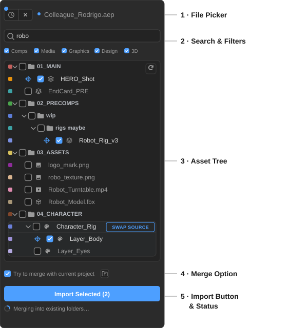
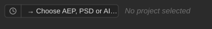
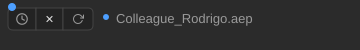
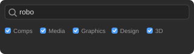
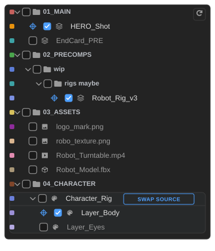
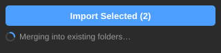
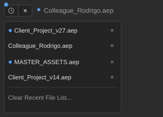

# Interface

The panel is divided into five zones, from top to bottom:

---

## File Picker

  

    
Before selecting a file

    
  

  

    
After loading a file

    
  

The top bar is where you load a source file.

| Control | Description |
| ------- | ----------- |
| **Clock button** | Opens the [Recent Projects](interface.md#recent-projects) list. A blue dot on this button means one or more recent projects have been updated since you last loaded them. |
| **→ Choose AEP, PSD or AI…** | Opens a file dialog to pick a source file. Supports `.aep`, `.psd`, `.psb`, and `.ai`. Once a file is loaded this becomes an **✕** button that clears the current file. |
| **File name** | Displays the name of the currently loaded file. Hover over it when it's truncated to see the full path. A blue dot next to the name means the loaded file has changed on disk since you opened it. |

---

## Search & Filters

- **Search bar**: filters the tree to items whose names match your query. Clear with the × button or by deleting the text.
- **Filter checkboxes**: show or hide items by type: **Comps**, **Media**, **Graphics**, **Design**, **3D**. OPT/ALT + click a filter to solo it (hide everything else); OPT/ALT + click again to restore all.

Filter preferences are saved between sessions.

---

## Asset Tree

The main panel shows the full folder and asset structure of the loaded file, mirroring After Effects' Project panel layout.

- **Folders** expand and collapse on click. OPT/ALT + click a folder arrow to collapse or expand all folders at once.
- **Comps** show a tooltip on hover with dimensions, duration, frame rate, and usage count.
- **Label colors** are shown as small swatches, matching After Effects' label palette.
- **Solids, Nulls, and Adjustment Layers** are excluded, since they're scaffolding, not reusable assets.
- The **↺ Reload** button (top-right corner of the tree) re-reads the file from disk without clearing your current selection.

**Checking an item** selects it for import. A **crosshair icon** appears next to each checked item; clicking it opens the [Target Picker](features.md#target-picker).

For any PSD or AI file, a **SWAP SOURCE** row appears above its layer items, whether that file was loaded directly or is nested inside an `.aep`. See [Swap Source](features.md#swap-source) for details.

---

## Merge Option

A single checkbox: **Try to merge with current project**.

When checked, imported content is folded into your existing folder structure: matching folders are combined rather than creating a new top-level import folder. See [Smart Merge](features.md#smart-merge) for the full behavior.

The small folder icon next to it opens [Folder Name Settings](features.md#folder-name-settings), where you customize the word lists that drive similar-name matching.

This preference is saved between sessions.

---

## Import Button & Status

**Import Selected (N)**: imports all checked items. The button shows the count of selected items and is disabled when nothing is checked.

A status line below the button shows progress during import, and a summary once it's done.

---

## Recent Projects

The clock button opens a dropdown list of the last 10 files you loaded in the panel. Each entry shows a blue dot if the file has been saved since you last loaded it here.

- Click an entry to load it immediately.
- Click **×** next to an entry to remove it from the list.
- Click **Clear Recent File List…** to wipe all entries.
