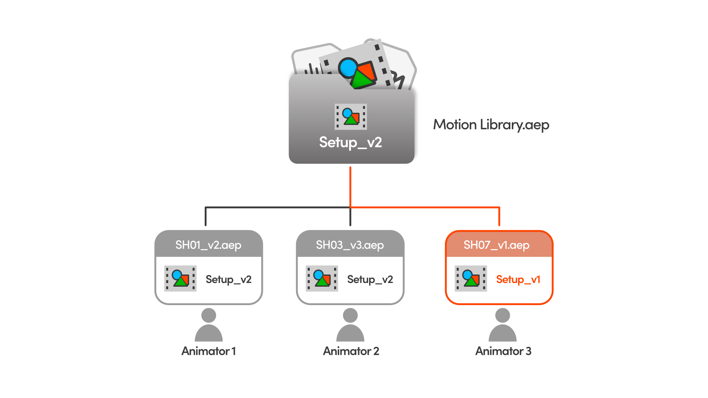

# Use Cases

---

AEP Transplant opens up many workflow possibilities. This section covers the most useful ones, each with a video and the best practices that keep it working on a real job.

---

<h2 id="motion-library">Motion Library</h2>

A Motion Library is an AEP project that holds the setups, animations, type treatments and brand assets you want to reuse, shared among the whole team.

Using a Motion Library and the right naming convention, your team stays on the same page, with consistency across the project and easy updates.

When the library changes, the [Update Watcher](features.md#update-watcher) makes it clear what's changed since you last loaded it. Re-import, and the old version is replaced in place. No duplicates, no messy imports.

Stop creating from scratch what's already been created by someone else, and move faster.

  <iframe src="https://www.youtube.com/embed/4hx9DuhP6o4" title="AEP Transplant | USE CASE 1: Motion Library" loading="lazy" allow="accelerometer; autoplay; clipboard-write; encrypted-media; gyroscope; picture-in-picture; web-share" referrerpolicy="strict-origin-when-cross-origin" allowfullscreen></iframe>

---

### Best practices

| Do this | Because |
| --- | --- |
| **Keep the library's file name constant** | It's what lets you take full advantage of the [Update Watcher](features.md#update-watcher) and the [Recent Projects](interface.md#recent-projects) list. I suggest making backups instead of bumping the library version. |
| **Bump the version in the comp name every time** | So everyone knows which version they have in their scene. |
| **One shared library, not a copy per animator** | Two copies drift apart, and then neither one is the source of truth. |
